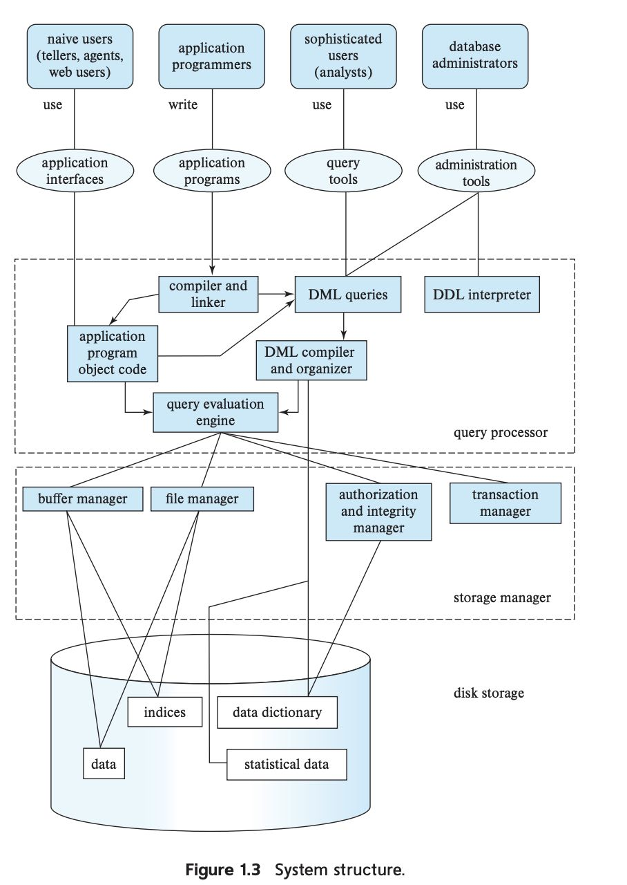
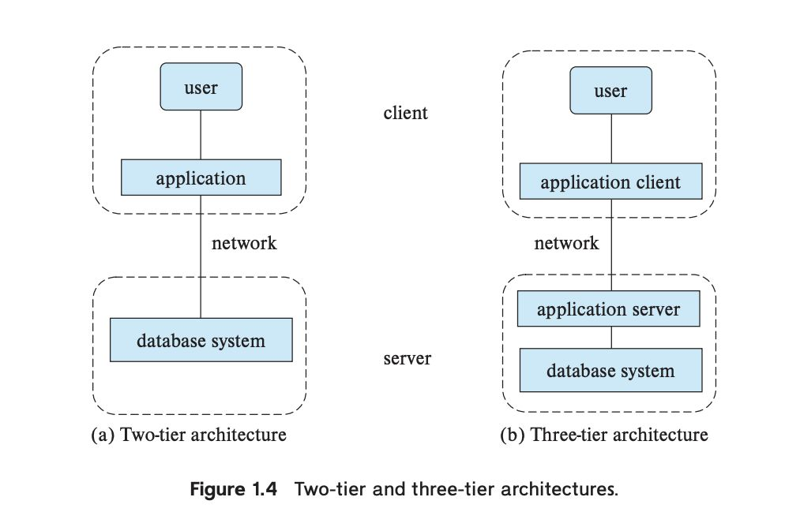

# Topic: Unit 1
----

### 1. Data:
    Data refers to raw, unorganized facts that need to be processed to become meaningful. It can be numbers, characters, images, audio, or any other format.

📌 Example:

 - A list of student names: ["John", "Alice", "Bob", "Emma"]
 - Temperature readings for a city: [25°C, 28°C, 27°C, 30°C]

### 2. Database:
    A database is an organized collection of data that allows users to store, retrieve, manage, and update information efficiently. Databases help structure and organize data in a way that makes it easy to access.

📌 Example:
- A student database that stores student information in a structured manner:

  | Student ID | Name  | Age | Course  |
  |------------|-------|-----|---------|
  | 101        | John  | 20  | CS      |
  | 102        | Alice | 19  | Math    |
  | 103        | Bob   | 21  | Physics |

### 3. Database System (DBMS - Database Management System):
    A database system (or DBMS) is software that allows users to interact with a database to store, retrieve, and manage data efficiently. It ensures data security, integrity, and consistency.

📌 Example:
- Some popular DBMS software includes:

- MySQL (used for websites and applications)
- Oracle Database (used in enterprise applications)
- MongoDB (a NoSQL database used for big data and flexible data storage)
- Microsoft SQL Server (used in business and corporate environments)

----
# Data Model
    A data model is how data is structured, stored, and managed in a database system.

## Data Models Classification
-  main categories for data models:

  - 1️. Entity-Relationship (ER) Model
    - Think of it like a diagram that shows how things (entities) are connected.
    - 📌 Example: A student enrolls in a course at a college.
Used to plan a database before creating it.

  - 2️. Semi-Structured Data Model 

    - Unlike traditional tables, this model stores data       flexibly using tags (like XML or JSON).
    
    - 📌 Example: A person's details in JSON format:
      - Used in web applications and NoSQL databases (like MongoDB).

  - 3️.  Object-Based Data Model

    - Stores data like objects in programming (like Java or Python).
    - 📌  Example: A Car object with properties (color, brand, speed) and actions (drive, stop).
    - Used in multimedia, games, and complex applications.

  - 4️. Relational Model

    - Stores data in tables with rows and columns.
    - 📌 Example: A Students table
      | ID  | Name  | Age |
      |-----|-------|-----|
      | 1   | Alice | 20  |
      | 2   | Bob   | 22  |.

### Importance of Data Models
- Provides a clear database structure before implementation.
-  Ensures data consistency, integrity, and security.
-  Improves database performance by optimizing storage and queries.
-  Facilitates communication between developers, analysts, and stakeholders.

### Early DBMS
- Difficult to update – Changes needed manual work.
- Easily broken – Small changes could cause big problems.
- Limited flexibility – Programmers had to plan all queries in advance.
- Hard to scale – Couldn’t grow easily with new needs.
- Time-consuming – Took a lot of effort to manage.

### Edgar F. Codd and his contribution:
 - Edgar F. Codd was a mathematician working at IBM in the late 1960s.
 - In 1969, he created the relational model a way to organize data using rows and columns.
 - This separated how data is stored from how it is used logical layer, making databases easier to manage and update.
 - In the late 1970s, IBM used his idea to create System R, which was the first practical application of the relational model.

### Relational Model
    Is a way of organizing and storing data in tables (also called relations), where:
  - Rows represent individual records (e.g., one student's details).
  - Columns represent attributes (e.g., name, age, or ID).

###  Database Languages 
    Database languages are used to define, manipulate, and manage databases.

- Data Definition Language (DDL): Used to define and modify database schemas.
  - Commands: CREATE, ALTER, DROP, TRUNCATE
  - 📌 Example: CREATE TABLE students (id INT, name VARCHAR(50));
  
- Data Manipulation Language (DML): Used to retrieve and modify data.
  - Commands: SELECT, INSERT, UPDATE, DELETE
  - 📌 Example: SELECT * FROM students;

   - Types of data manipulation language
     - Procedural DML
     - Declarative DMLs(nonprocedural DMLs)

### Data Abstraction
    Data abstraction means that developers hide the complex details of how data is stored or structured in a database.

- Physical Level – How data is physically stored (e.g., hard drives, files). Users don’t see this part.
  - 📌 Example: Data saved as files on a disk.

- Logical Level – What data is stored and how it's organized (tables, relationships).
  - 📌 Example: A student database with names, IDs, and courses.

- View Level – What users see, based on their role. Different users see different data.
  - 📌 Example: A student sees their grades, but a teacher sees all students' grades.

### Database Instances and Schemas
    Database Instance: The collection of informationstored in the database at a particular moment iscalled an instance of the database.

    Database schema: Overall design or blueprint of the database.

### Database Design

1. Choose a data model

2. Develop a conceptual design 

3. Develop Logical design

4. Develop Physical design

### database engine
    A database engine is the core part of a database system that stores, manages, and processes data. It handles:
 - Storing data on disk
 - Retrieving data when needed
 - Updating and deleting records
 - Managing queries (like SQL commands)

###  Database System Architecture 
    A database system architecture consists of various components that ensure efficient data management.

### Architecture of Applications that use Databases as Backend
