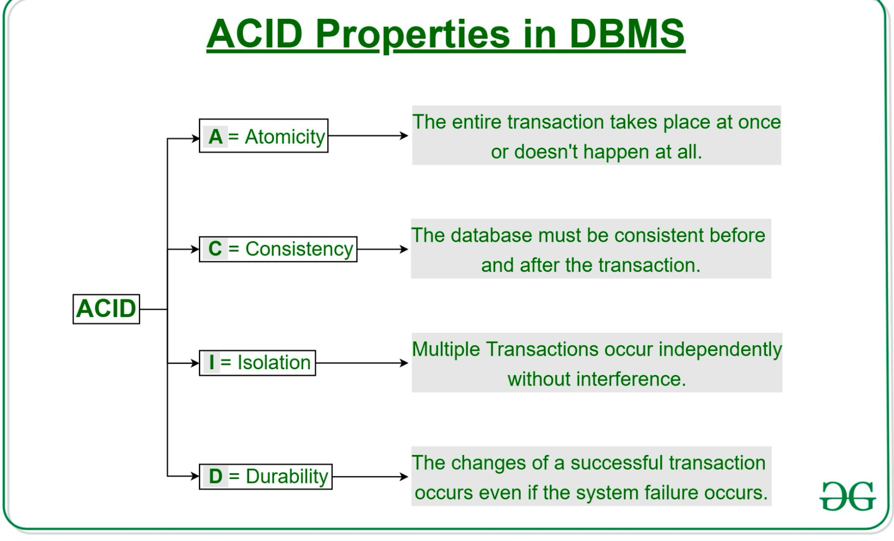
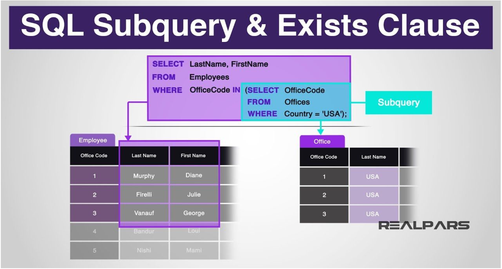

# Topic Unit 3
---
 ## Transaction
    A transaction is a single logical unit of work
    that accesses and possibly modifies the contents
    of a database.

- It ensures that either everything happens correctly or nothing happens at    all, keeping the database consistent and error-free.

## Acid property
- Atomicity: Ensures that a transaction is treated as a single unit, either fully completing or not executing at all.

- Consistency: Guarantees that a transaction brings the database from one valid state to another, maintaining integrity.

- Isolation: Ensures that concurrent transactions do not interfere with each other, maintaining data accuracy.

- Durability: Ensures that once a transaction is committed, it remains permanent, even in the event of a system failure.

## History of SQL
SQL (Structured Query Language) was created in the early 1970s by IBM researchers Donald D. Chamberlin and Raymond F. Boyce as part of the System R initiative. It was originally named SEQUEL (Structured English Query Language) but was subsequently renamed SQL because of trademark complications.

## Parts of SQL
- 1. DDL
- 2. DML
- 3. Integrity
- 4. View Definition
- 5. Transaction Control
- 6. Embedded SQL and dynamic SQL
- 7. Authorization

## SQL Data 
    How a database is structured and maintained. 

- It includes:

  Schema – The structure of tables (columns, data types, and relationships).

  Data Types – Defines what kind of values each column can store (e.g., INT, VARCHAR).

  Integrity Constraints – Rules to maintain data accuracy (e.g., PRIMARY KEY, FOREIGN KEY).

  Indexes – Speed up searching by organizing data efficiently.

  Security & Authorization – Controls who can access or modify the data.

  Physical Storage – How data is stored on disk for performance optimization.

## SQL Constraints 
    SQL constraints are rules that ensure the accuracy and consistency of data in a table. They prevent invalid data from being entered and help maintain data integrity. If data does not follow the rules, the database rejects the operation.

- Common SQL Constraints:

1. NOT NULL – Ensures a column cannot have empty (NULL) values.

2. UNIQUE – Ensures all values in a column are different.

3. PRIMARY KEY – A combination of NOT NULL and UNIQUE; uniquely identifies each record.

4. FOREIGN KEY – Links two tables to maintain referential integrity.

5. CHECK – Ensures values in a column meet a specific condition.

6. DEFAULT – Sets a default value for a column if no value is provided.

7. CREATE INDEX – Improves the speed of data retrieval but does not enforce uniqueness (unless UNIQUE INDEX is used).

## What I learned from the  foundation for designing, creating, and interacting with relational databases.

 I have learned that SQL DDL (Data Definition Language) is used to define and manage database structures. Proper schema design includes tables, relationships, and constraints.PostgreSQL commands (\l, \dt, \d+) help how we inspect and manage databases.Therefore Data manipulation (insertion, querying) is done after schema creation.

## Subqueries
    A subquery is a select-from-where expression
    that is nested within another query.

## Conclusion
I now have a thorough understanding of database systems, including everything from fundamental ideas to sophisticated strategies. Lesson 6 covered SQL basics such data types, constraints, and schema development in addition to the essential ACID principles that guarantee database dependability.

 I gained a better understanding of how databases preserve structure and integrity through the practical activities where I practiced making tables and adding data. I was ready for the more difficult subjects that came after this strong foundation.

From lesson 7 I got proficient in fundamental tasks including merging several tables, changing database structures, and filtering data using WHERE clauses. Using LIKE for pattern matching and AS for column aliasing were two very useful strategies that increased the effectiveness of my queries. 

I felt more comfortable using these abilities in real-world situations after working through the airline ticketing database examples, which demonstrated to me how accurate database administration can address real-world issues.

I was prepared to take on more complex ideas by Lesson 8, which really improved my database knowledge. I gained knowledge on how to appropriately handle NULL values, analyze data using aggregate functions, and create nested subqueries for intricate data retrieval. My eyes were opened to SQL's potent analytical possibilities by the advent of window functions and CTEs. I now possess the theoretical understanding and practical abilities necessary to deal with databases efficiently thanks to this journey from fundamental concepts to complex procedures. Now that I understand the rationale behind each, I feel ready to construct, query, and maintain databases.